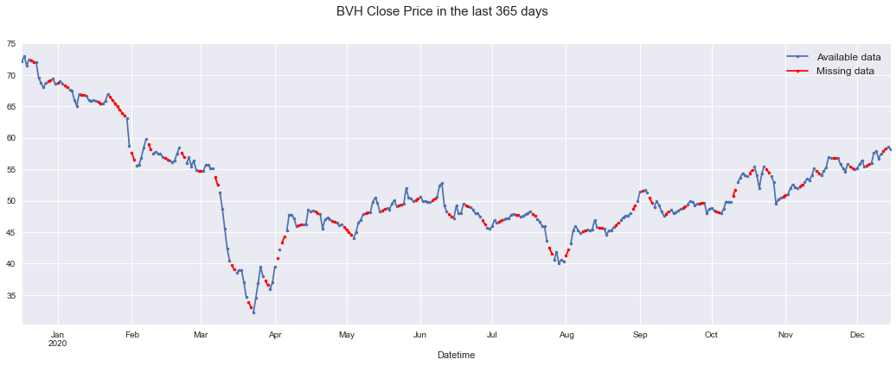

Lớp **Môn Khoa học dữ liệu và Ứng dụng - 17/21**  
Học kì II, 2019 - 2020  

---

# ĐỒ ÁN CUỐI KÌ

### Dự đoán giá cổ phiếu

---

## 1. Thông tin nhóm 

| Tên  |MSSV|
|-|:-:|
| Trần Minh Trí |1712834|
| Nguyễn Nhật Trường |1712852|

## 2. Nội dung đồ án

#### Giới thiệu đồ án

* Dự đoán giá cổ phiếu dựa theo pattern giá trong quá khứ.
* Trả lời được câu hỏi trên sẽ giúp người chơi cổ phiếu quyết định mua hay bán một loại cổ phiếu nào đó.

#### Nguồn dữ liệu

* Trang web [CafeF](https://s.cafef.vn/) là nguồn sử dụng để thu thập dữ liệu. Từng loại cổ phiếu được sử dụng sẽ được thu thập thông qua trang tìm kiếm của cổ phiếu đó, cụ thể: [BHV](https://s.cafef.vn/Lich-su-giao-dich-BVH-1.chn?fbclid=IwAR0e98txe3qOw8SP_cTAVxXqeTN2CnuAiOnnLMzUXovyH-zJRZXVNBWU2sg).

#### Thu thập dữ liệu

* Dữ liệu được thu thập bằng phương thức parse HTML sử dụng Selenium.

#### Khám phá dữ liệu

* Có 5 cột:
  * `Date`: ngày.
  * `Open`: giá mở cửa.
  * `High`: giá cao nhất.
  * `Low`: giá thấp nhất.
  * `Close`: giá đóng cửa.
* Trong đó, cột `Date` có kiểu dữ liệu `datetime`, các cột còn lại có kiểu `float`.
* Dữ liệu (chưa tiền xử lý) có 2868 dòng và 5 cột.
* Dự đoán giá cổ phiếu là ta sẽ thực hiện **dự đoán giá đóng cửa cho các ngày kế tiếp**.

#### Các vấn đề sau khi thu thập dữ liệu

* Dữ liệu thu thập được là các dòng theo từng ngày, tuy nhiên, có một số ngày bị thiếu do website không cập nhật giá cổ phiếu.

---

## 3. Chi tiết đồ án

### 3.1 Tiền xử lý dữ liệu

* **wip---**

### 3.2 Trực quan hóa dữ liệu

* Sau khi hoàn thành tiền xử lý, ta có dữ liệu cổ phiếu BVH như sau:

* Do các giá có xu hương tương tự nhau và như đã nói ở trên, giá đóng cửa `Close` sẽ là thành phần giá chính được sử dụng để dự đoán giá cổ phiếu, ta sẽ thực hiện phân tích thành phần chuỗi thời gian (**Time-series decompositon**) cho dãy giá đóng. Quá trình này cho phép chuỗi thời gian được thể hiện qua 3 đặc trưng chính là **Trend**, **Seasonality** và **Noise**:

* **adding---**

### 3.3 Mô hình hóa

* **wip---**

### 3.5 Train model

* **wip---**

### 3.6 Output

* **wip---**

## 4. Đánh giá

### 4.1 Phân công

| Tên  |MSSV|Công việc thực hiện|
|-|:-:|-:|
| Trần Minh Trí |1712834|-------|
| Nguyễn Nhật Trường |1712852|-------|

### 4.2 Đánh giá đồ án

* **wip---**

## 5. Hướng dẫn chạy file Notebook

* **wip---**