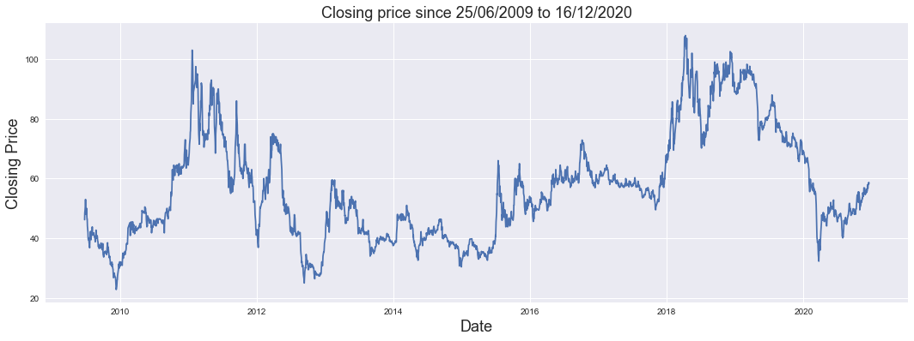
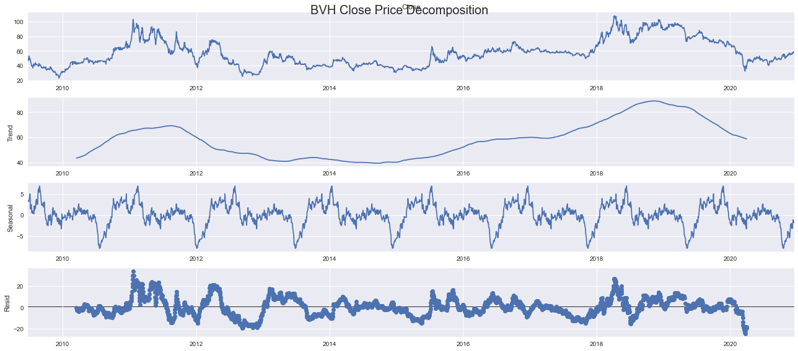
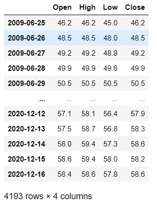
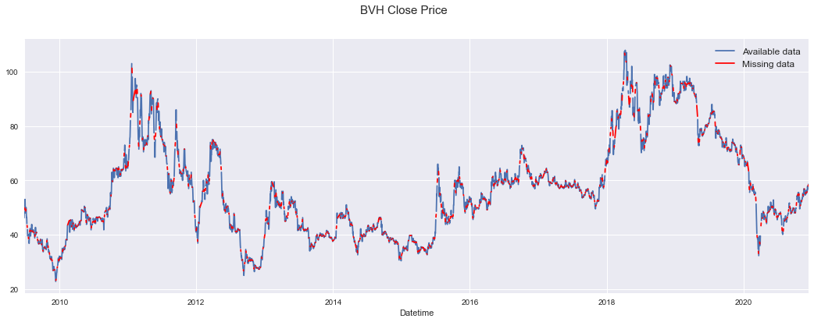
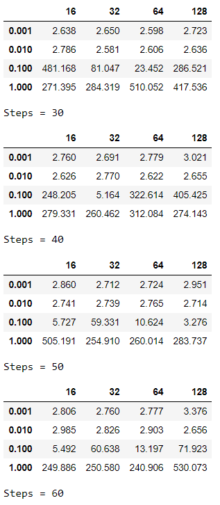
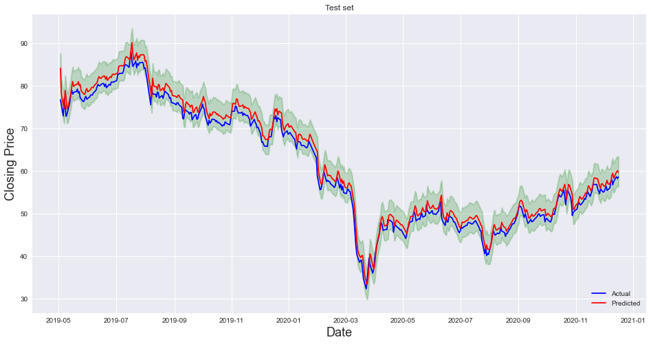

Môn **Khoa học dữ liệu**  
Học kì I, 2020 - 2021

---

# ĐỒ ÁN CUỐI KÌ

### Nhóm 5 - Dự đoán giá cổ phiếu

---

## 1. Thông tin nhóm 

| Tên  |MSSV|GitHub|
|-|:-:|-|
| Trần Minh Trí |1712834|[StrugVN](https://github.com/StrugVN)|
| Nguyễn Nhật Trường |1712852|[cripplinmuffin](https://github.com/cripplinmuffin)|

## 2. Nội dung đồ án

#### Giới thiệu đồ án

* Dự đoán giá cổ phiếu dựa theo pattern giá trong quá khứ.
* Trả lời được câu hỏi trên sẽ giúp người chơi cổ phiếu quyết định mua hay bán một loại cổ phiếu nào đó.

#### Nguồn dữ liệu

* Trang web [CafeF](https://s.cafef.vn/) là nguồn sử dụng để thu thập dữ liệu. Từng loại cổ phiếu được sử dụng sẽ được thu thập thông qua trang tìm kiếm của cổ phiếu đó, cụ thể: [BHV](https://s.cafef.vn/Lich-su-giao-dich-BVH-1.chn?fbclid=IwAR0e98txe3qOw8SP_cTAVxXqeTN2CnuAiOnnLMzUXovyH-zJRZXVNBWU2sg).

#### Thu thập dữ liệu

* Dữ liệu được thu thập bằng phương thức parse HTML sử dụng `selenium`, đến ngày 17/12/2020.

#### Khám phá dữ liệu

* Có 5 cột:
  * `Date`: ngày.
  * `Open`: giá mở cửa.
  * `High`: giá cao nhất.
  * `Low`: giá thấp nhất.
  * `Close`: giá đóng cửa.
* Dữ liệu (chưa tiền xử lý), sau khi đưa cột `Date` thành index, có 2868 dòng và 4 cột, với cả 4 cột đều có kiểu dữ liệu `float`:

* Ở đồ án này chỉ sử dụng cột `Close` cho mô hình hóa và dự đoán, dữ liệu được trực quan như sau:

#### Phân tích thành phần chuỗi thời gian (Time-series decomposition)

* Quá trình này cho phép chuỗi thời gian được thể hiện qua 3 đặc trưng chính là **Trend**, **Seasonality** và **Noise**. Tuy nhiên, do dữ liệu được sử dụng bị thiếu ở một số ngày (vấn đề này sẽ được xử lý ở dưới), chuỗi thời gian được sử dụng không có tần số (*frequency*) cụ thể, dẫn đến quá trình decompose không thể diễn ra.
* Để khắc phục vấn đề trên, ta phải tự định nghĩa "chu kỳ" (*period* theo [document](https://www.statsmodels.org/stable/generated/statsmodels.tsa.seasonal.seasonal_decompose.html)) của chuỗi thời gian. Period ở đây được hiểu là số lần *\observation\* (quan sát) trước khi chu trình lặp lại (có nghĩa là sang năm mới: ngày 31/12 trở về 01/01 - lặp lại chu trình). Ví dụ, giả sử dữ liệu thu thập theo từng tháng, tức là dữ liệu được quan sát 12 lần trong 1 năm hay `period = 12`. Ta cũng có thể gọi trường hợp trên là **monthly time series**.
* Đối với bài toán hiện tại, giá cổ phiếu được thu thập "hàng ngày" trên trang web, nên ta mong muốn dữ liệu được sử dụng là **daily time series**. Tương ứng, ta đặt `period = 365`.

* Ta có nhận xét: chuỗi thời gian không có xu hướng - **trend** nào rõ rệt nhưng tính **seasonality** cho biết dữ liệu có diễn biến lặp lại mỗi ~18 tháng. Tuy nhiên, phần **noise** (residue) cho thấy dữ liệu vẫn mang tính ngẫu nhiên cao.

#### Các vấn đề sau khi thu thập dữ liệu

* Dữ liệu thu thập được là các dòng theo từng ngày, tuy nhiên, có một số ngày bị thiếu do website không cập nhật giá cổ phiếu vào các ngày đó. Ta cần phải tiền xử lý dữ liệu để "fill" các giá trị còn thiếu ở các ngày đó.

---

## 3. Chi tiết đồ án

### 3.1 Tiền xử lý dữ liệu

* **Cách xử lý**: Thêm những điểm dữ liệu thiếu bằng đoạn giữa với 2 đầu là 2 điểm quan sát được. (VD: [1, nan, nan, 7] -> [1, 3, 5, 7])
* Sau khi tiền xử lý, dữ liệu mới gồm có 4193 dòng và 4 cột:

* Trực quan kết quả sau khi tiền xử lý:

* Biểu đồ dưới đây chỉ thể hiện giá trong 365 ngày cuối để dễ nhìn hơn số liệu thiếu được thêm vào:

### 3.2 Mô hình hóa

* **Tách dữ liệu**: Dữ liệu ban đầu được chia thành 3 tập: train, validation, test với tỉ lệ (gần đúng) 70% - 15% - 15%.
* **Chuẩn hóa dữ liệu**: Nhóm sử dụng MinMaxScaler để chuẩn hóa dữ liệu về `range(0, 1)`.
* **Chuyển dữ liệu về các timestep sequences**:
    * Tập X (input) chứa dữ liệu giá đóng cửa *step* ngày trước ngày *n* cần dự đoán.
    * Tập Y (output) chứa dữ liệu giá đóng cửa 1 ngày *n* cần dự đoán.

* Các bước trên được truyền vào một pipeline.

### 3.3 Train model

* Nhóm sử dụng **mô hình LSTM** của thư viện `keras`,  sau đó, thực hiện validation với các tham số `step`, `learning rate` và `batch_size`.
* Kết quả các model 1 ngày:

* Kết quả các model 7 ngày:

### 3.4 Kết quả

* Model 1 ngày tốt nhất được chọn:

* Model 7 ngày tốt nhất được chọn:

* Trực quan hóa kết quả của model được chọn trên tập validation:
* Model 1 ngày:

* Model 7 ngày:

* Độ lỗi trên tập test sau khi huấn luyện model được chọn với dữ liệu train và validation:
* Model 1 ngày:

* Model 7 ngày:

### 3.5 Dự đoán

* Nhóm thử dự đoán giá đóng cửa cho 7 ngày tiếp theo, với mỗi ngày dự đoán được thêm vào chuỗi quan sát để dự đoán cho ngày tiếp theo:
    * Y(n) = f(O(n-1), O(n-2),...)
    * Y(n+1) = f(Y(n), O(n-1), O(n-2),...)
* Kết quả thu được như sau:
* Model 1 ngày:

* Model 7 ngày:

## 4. Đánh giá

#### Kinh nghiệm tích lũy

* Qua đồ án này, nhóm học được nhiều về mô hình hóa dự đoán cho kiểu dữ liệu chuỗi thời gian, kiểu dữ liệu chưa được demo trực tiếp trong khóa học.
* Học và làm quen với sử dụng pipeline cho việc huấn luyện được gọn gàng hơn.

#### Khó khăn
* Lần đầu tiếp xúc với việc dự đoán trên kiểu timeseries nên nhóm phải tốn nhiều thời gian nghiên cứu, nhưng thấy được đó vẫn chưa đủ.
* Tiền xử lý, mô hình hóa còn nhiều chỗ có thể cải tiến để thu được mô hình tốt hơn.

#### Hướng phát triển nếu có thêm thời gian
* Tìm hiểu thêm các phương pháp tiền xử lí để cải tiến mô hình.
* Tìm hiểu thêm về cách dự đoán tương lai gần khi đã có mô hình máy học.
* Tìm hiểu thêm và chạy thử các siêu tham số trên cái layer.
.
## 5. Hướng dẫn chạy file Notebook

* Cài đặt `tensorflow` và `keras`:
    * Trước hết, ta cần cài đặt `tensorflow` trên Anaconda Command Prompt (ở đây đặt tên là `tf`):
    
    

    * Sau đó, sử dụng Anaconda Navigator, trên môi trường `tf`, tìm kiếm và cài đặt `keras`:
    
    
    
    * Cuối cùng, mở jupyter notebook sau khi kích hoạt môi trường `tensorflow` để chạy file notebook.
    
* Phần thu thập dữ liệu sử dụng hai thư viện không có sẵn là `selenium` và `requests-HTML`. Hai thư viện này cần được cài đặt trên môi trường `tensorflow` trên, thông qua Anaconda Command Prompt, với cú pháp tương ứng là `pip install selenium` và `pip install requests-html`.
* Với `selenium`, cần tải về phiên bản [chromedriver](https://chromedriver.chromium.org/downloads) phù hợp dựa theo phiên bản trình duyệt Google Chrome của máy, và lưu chung với thư mục chứa file notebook. Dữ liệu đã được lưu ở trong thư mục *csv*.

* Sau khi đã cài đặt các thư viện cần thiết, file notebook chạy bình thường thông qua `Kernel - Restart & Run All`.

## 6. Nguồn tham khảo

[1] https://insights.magestore.com/posts/giai-thuat-time-series-forecasting

[2] https://www.datacamp.com/community/tutorials/lstm-python-stock-market

[3] https://randerson112358.medium.com/stock-price-prediction-using-python-machine-learning-e82a039ac2bb

[4] https://viblo.asia/p/lam-quen-voi-keras-gGJ59mxJ5X2

[5] https://www.tensorflow.org/api_docs/python/tf/keras/Sequential

[6] https://www.tensorflow.org/api_docs/python/tf/keras/optimizers

[7] https://www.tensorflow.org/api_docs/python/tf/keras/layers/LSTM

[8] https://www.tensorflow.org/api_docs/python/tf/keras/layers/Dense

[9] https://viblo.asia/p/optimizer-hieu-sau-ve-cac-thuat-toan-toi-uu-gdsgdadam-Qbq5QQ9E5D8

[10] https://www.phamduytung.com/blog/2018-10-02-understanding-epoch-batchsize-iterations/

[11] https://otexts.com/fpp2/prediction-intervals.html
