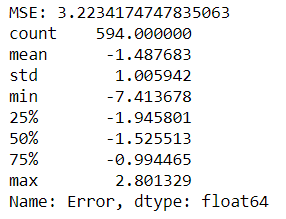
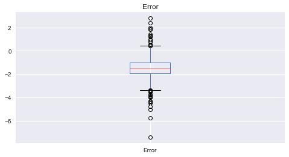
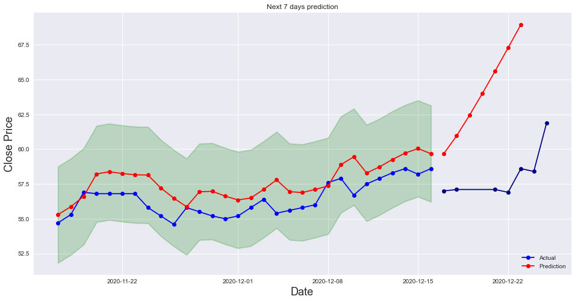

Lớp **Môn Khoa học dữ liệu và Ứng dụng - 17/21**  
Học kì II, 2019 - 2020  

---

# ĐỒ ÁN CUỐI KÌ

### Dự đoán giá cổ phiếu

---

## 1. Thông tin nhóm 

| Tên  |MSSV|
|-|:-:|
| Trần Minh Trí |1712834|
| Nguyễn Nhật Trường |1712852|

## 2. Nội dung đồ án

#### Giới thiệu đồ án

* Dự đoán giá cổ phiếu dựa theo pattern giá trong quá khứ.
* Trả lời được câu hỏi trên sẽ giúp người chơi cổ phiếu quyết định mua hay bán một loại cổ phiếu nào đó.

#### Nguồn dữ liệu

* Trang web [CafeF](https://s.cafef.vn/) là nguồn sử dụng để thu thập dữ liệu. Từng loại cổ phiếu được sử dụng sẽ được thu thập thông qua trang tìm kiếm của cổ phiếu đó, cụ thể: [BHV](https://s.cafef.vn/Lich-su-giao-dich-BVH-1.chn?fbclid=IwAR0e98txe3qOw8SP_cTAVxXqeTN2CnuAiOnnLMzUXovyH-zJRZXVNBWU2sg).

#### Thu thập dữ liệu

* Dữ liệu được thu thập bằng phương thức parse HTML sử dụng Selenium.

#### Khám phá dữ liệu

* Có 5 cột:
  * `Date`: ngày.
  * `Open`: giá mở cửa.
  * `High`: giá cao nhất.
  * `Low`: giá thấp nhất.
  * `Close`: giá đóng cửa.
* Dữ liệu (chưa tiền xử lý), sau khi đưa cột `Date` thành index, có 2868 dòng và 4 cột, với cả 4 cột đều có kiểu dữ liệu `float`:

#### Các vấn đề sau khi thu thập dữ liệu

* Dữ liệu thu thập được là các dòng theo từng ngày, tuy nhiên, có một số ngày bị thiếu do website không cập nhật giá cổ phiếu vào các ngày đó. Ta cần phải tiền xử lý dữ liệu để "fill" các giá trị còn thiếu ở các ngày đó.

---

## 3. Chi tiết đồ án

### 3.1 Tiền xử lý dữ liệu

* **Cách xử lý**: Thêm những điểm dữ liệu thiếu bằng đoạn giữa với 2 đầu là 2 điểm quan sát được. (VD: [1, nan, nan, 7] -> [1, 3, 5, 7])
* Sau khi tiền xử lý, dữ liệu mới gồm có 4193 dòng và 4 cột:

### 3.2 Trực quan hóa dữ liệu

* Ta có biểu đồ giá đóng cho cổ phiếu BVH như sau:

* Biểu đồ dưới đây chỉ thể hiện giá trong 365 ngày cuối để dễ nhìn hơn số liệu thiếu được thêm vào:

* Với bộ dữ liệu được xử lý đầy đủ, ta sẽ thực hiện phân tích thành phần chuỗi thời gian (**Time-series decomposition**) cho dãy giá đóng. Quá trình này cho phép chuỗi thời gian được thể hiện qua 3 đặc trưng chính là **Trend**, **Seasonality** và **Noise**:

* Ta có nhận xét: chuỗi thời gian hoàn toàn không có tính **seasonality** hay có xu hướng - **trend** nào rõ rệt. Hơn nữa, xét về **noise**, dữ liệu mang tính khá ngẫu nhiên.
* Ta cũng xem qua **Autocorrelation** và **Partial autocorrelation** cho chuỗi thời gian:

* Theo biểu đồ **Autocorrelation**, đến lag thứ 50, autocorrelation function ở các lag này có giá trị cách biệt đáng kể so với 0 (*statistically significant*). Có nghĩa là, giá cổ phiếu, ở đây đang xét của BVH, có tính tự tương quan lớn, tức là, nếu giá có tăng, nó thường sẽ tiếp tục tăng và ngược lại.
* Ở biểu đồ **Partial autocorrelation**, có rất nhiều lag có giá trị vượt khỏi vùng màu xanh khoảng tin cậy. Các giá trị này có thể được nhận xét là chúng mang tính *statistically significant*.

### 3.2 Mô hình hóa

* **Tách dữ liệu**: Dữ liệu ban đầu được chia thành 3 tập: train, validation, test với tỉ lệ (gần đúng) 70% - 15% - 15%.
* **Chuẩn hóa dữ liệu**: Nhóm sử dụng MinMaxScaler để chuẩn hóa dữ liệu về `range(0, 1)`.
* **Chuyển dữ liệu về các timestep sequences**:
    * Tập X (input) chứa dữ liệu giá đóng cửa *step* ngày trước ngày *n* cần dự đoán.
    * Tập Y (output) chứa dữ liệu giá đóng cửa 1 ngày *n* cần dự đoán.
    * Biến **lag** là khoảng cách giữa **ngày dự đoán** đến **ngày quan sát được gần nhất - 1**. VD:
        * lag=0 -> Y(n) = f(O(n-1), O(n-2),...)
        * lag=2 -> Y(n) = f(O(n-3), O(n-4),...)

### 3.3 Train model

* Nhóm sử dụng **mô hình LSTM** của thư viện `keras`,  sau đó, thực hiện validation với các tham số `step`, `lag` và `batch_size` (log khi train được lưu ở file "model_log.txt").
* Kết quả chọn ra các model tốt nhất cho từng lag:

* Trực quan hóa các model được chọn trên tập validation:

### 3.4 Kết quả

* Kết quả cho thấy được độ lỗi của `lag = 1, 3` cao hơn nhiều so với `lag = 0`, nhóm quyết định chỉ chọn model tốt nhất `lag = 0` làm model cuối cùng.
* Độ lỗi của model cuối trên tập test:

### 3.5 Dự đoán

* Nhóm thử dự đoán giá đóng cửa cho 7 ngày tiếp theo, với mỗi ngày dự đoán được thêm vào chuỗi quan sát để dự đoán cho ngày tiếp theo:
    * Y(n) = f(O(n-1), O(n-2),...)
    * Y(n+1) = f(Y(n), O(n-1), O(n-2),...)
* Kết quả thu được như sau:

## 4. Đánh giá

### 4.1 Phân công

| Tên  |MSSV|Công việc thực hiện|
|-|:-:|-:|
| Trần Minh Trí |1712834| Huấn luyện mô hình |
| Nguyễn Nhật Trường |1712852| Thu thập, khám phá dữ liệu + Báo cáo |

### 4.2 Đánh giá đồ án

* **wip---**

## 5. Hướng dẫn chạy file Notebook

* **wip---**